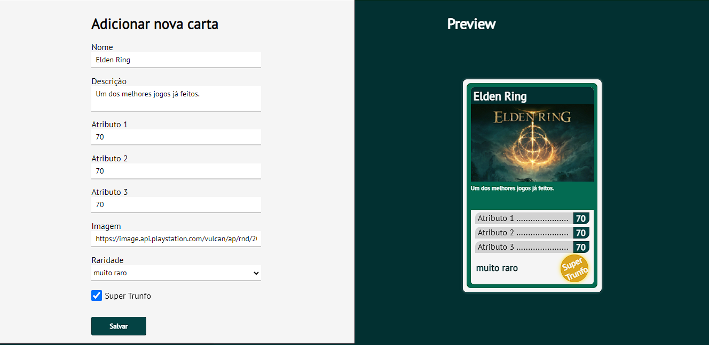
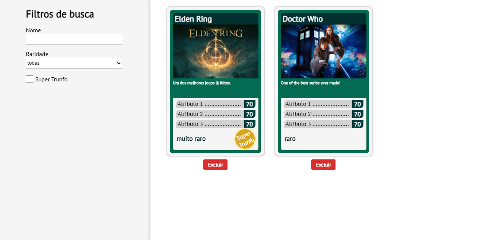

  

# Projeto Tryunfo

Um projeto feito por mim durante o módulo de Front End na Trybe.

Consiste em um criador de cartas no estilo Super Trunfo.
Podem ser criadas com diversas opções e depois de salvas podem ser filtradas e excluídas.

## Deploy

A aplicação está disponível pelo github pages, neste [link.](https://brendon-lopes.github.io/tryunfo/)

## Screenshots

## Aprendizados

Com esse projeto consegui me aprofundar mais em React, usando componentes de classe.
Também aprendi a componentizar melhor e reutilizar esses componentes quando necessário, salvar os dados de cada carta de forma organizada para ser reutilizada e construir filtros específicos.
Mas um dos maiores desafios, e que gerou o maior aprendizado, foi trabalhar com o CSS para fazer o layout das cartas.

## Stack utilizada

**Front-end:** JavaScript, React, CSS.

